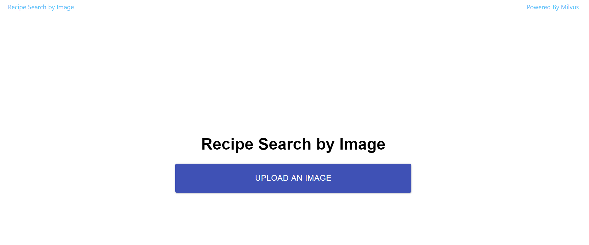
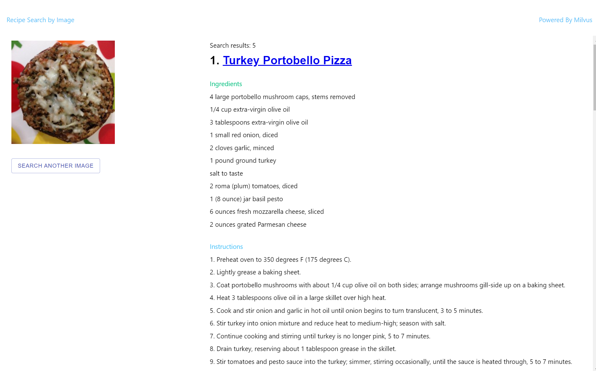

# README

本项目基于 milvus 实现了一个图片和食谱的检索系统。即输入一张食物图片，返回该图片对应的食谱。

本项目是基于项目 [im2recipe-Pytorch](https://github.com/torralba-lab/im2recipe-Pytorch) 实现的。

## 数据说明

**数据说明**

本项目的数据来自 [recipe1M](http://pic2recipe.csail.mit.edu/). recipe1M 是一个大规模结构化语料库，包含超过一百万种烹饪食谱和一千三百万种食物图像。

**数据下载** 

在本项目中用的是 recipe1M 中的数据集。你可以从[recipe1M](http://pic2recipe.csail.mit.edu/) 网站上下载数据集和模型。本项目也提供了部分数据集和模型 。

链接：https://pan.baidu.com/s/1GpPqRTjiBen0qoudAWZn6g 
提取码：bptf


## 脚本说明

本项目中包含了 service 和 webclient 两部分.

service 提供了后端服务的代码。webclient 提供了前端界面的脚本。

service 中的配置文件 config.py 说明：

| Parameter         | Description                         | Default                               |
| ----------------- | ----------------------------------- | ------------------------------------- |
| MILVUS_HOST       | Milvus 服务所在的地址               | 127.0.0.1                             |
| MILVUS_PORT       | Milvus 服务的端口号                 | 19530                                 |
| MYSQL_HOST        | MySql 服务所在的地址                | 127.0.0.1                             |
| MYSQL_PORT        | MySql 服务的端口号                  | 3306                                  |
| MYSQL_USER        | MySql 的用户名                      | root                                  |
| MYSQL_PASSWORD    | MySql 的密码                        | 123456                                |
| MYSQL_DATABASE    | MySql 的 database 名                | mysql                                 |
| TABLE_NAME        | 在 Milvus 的集合名以及 MySql 的表名 | recipe                                |
| data_path         | 待导入的数据集 `lmdb`               | data/test_lmdb                        |
| file_keys_pkl     | 导入数据集对应的keys文件            | data/test_keys.pkl                    |
| recipe_json_fname | 食谱原始数据集json文件。            | data/recipe1M/layer1.json             |
| im_path           | 查询时，客户端上传图片存储的位置    | data/ima_test                         |
| model_path        | 指定模型                            | data/model/model_e500_v-8.950.pth.tar |
| ingrW2V           | `vocab.bin` 所在的路径。            | data/vocab.bin                        |
| temp_file_path    | 生成导入 MySql 的数据的临时文本     | temp.csv                              |
| collection_param  | Milvus 创建集合时的参数             | default                               |
| search_param      | Milvus 查询时的参数                 | 16                                    |
| top_k             | 结果展示的食谱的数量                | 5                                     |


## 搭建步骤

1. 安装 Milvus0.10.2，参考  [Milvus安装](https://milvus.io/cn/docs/v0.10.2/milvus_docker-cpu.md)。

2. 安装 MySql.

3. 拉取项目

```shell
git clone https://github.com/milvus-io/bootcamp.git
#进入本项目的目录下
cd bootcanp/solution/im2recipe
```

4. 安装依赖

```shell
pip3 install -r requirement.txt
```

5. 导入数据

```
python load.py
```

> 导入的是 `config.py` 中 `data_path` 指定的数据。导入前检查该参数的路径是否正确。

6. 启动查询服务

```shell
uvicorn main:app
```

> 本项目使用 `FastAPI` 构建 `API`, 启动服务后，输入网址 127.0.0.1:8000/docs 可查看该服务提供的接口。点击 `/search/ Do Search Api` ，再点击 `Try it out`。然后就可以查询了，在参数 `image`选择一张本地的食谱图片，点击 `Excute` 即可。


7. 启动前端界面

```shell
docker run -d -p 80:80 -e API_URL=http://127.0.0.1:8000 zilliz/milvus-search-food-recipes:latest
```

> `API_URL` 该值是服务端所在的 `IP` 和 `port`
>
> 本项目也提供了前端展示界面。你也可以在前端界面体验本项目。


## 结果展示

打开网页 127.0.0.1:80, 前端展示如图，点击 `UPLOAD AN IMAGE`选择要搜索的食物图像。



检索结果如图，会展示检索到的食物的标题和食谱。


